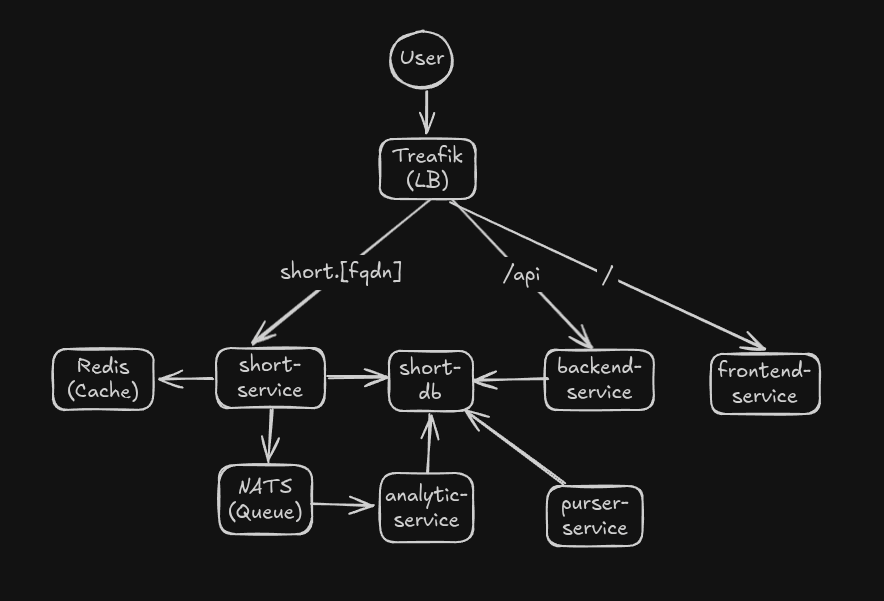

# EDA Experimenting with Podman's Kube

This is my experiment where I try to build an EDA (Event-driven Architecture) system of a URL shortener using Podman’s Kube, which is a Kubernetes emulator.

To run this project, you must have Podman running as a user daemon, and your UID must be 1000 (this would rarely be a problem, as it’s the default UID of the first user). Add the domains from the file `domain.txt` to your `/etc/hosts` files. Run `env/up.sh`. Finally, trust the CA file `linkiguess-ca.crt` (an example of this is `trust anchor linkiguess-ca.crt`; after that, `trust extract-compat`).

By default the DB is initialized with two short links `rust` and `google`.  To access these links you must append them to the FQDN of the shortener service,  `short.linkiguess.localhost`, i.e., `https://short.linkiguess.localhost/rust`. If you wish to add a link, you 'SSH' into the DB using the command `env/sh/short-pg.sh`, and run `devscript/insert-link.sh [short link] [long link]`.

You can view the short links and their clicks if you access the link, `https://linkiguess.localhost`.

## Infrastructure

THe Kubernetes script creates both a Traefik and a Grafana dashboard including the default datasource. Their access username and password is `admin`.

The Traefik dashboard can be found at `traefik.admin.linkiguess.localhost`, and respectfully, the Grafana dashboard at `grafana.admin.linkiguess.localhost`.

The diagram of this system is:

